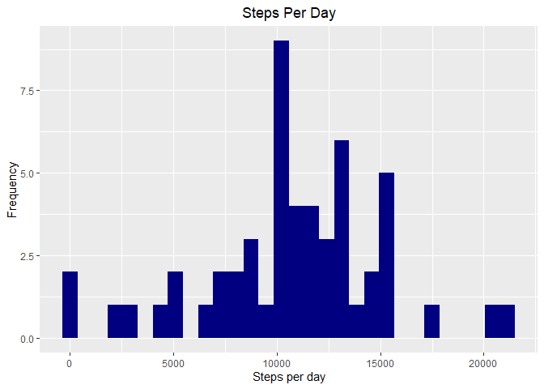
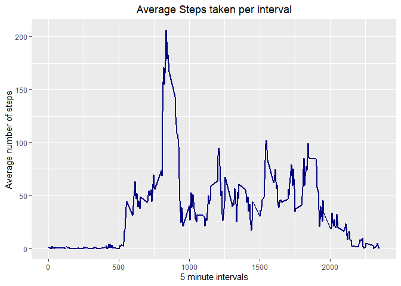
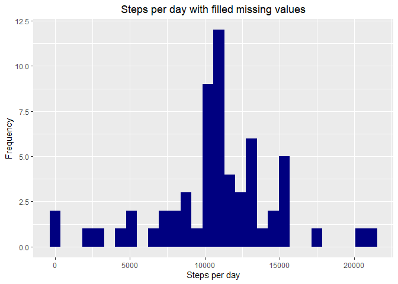
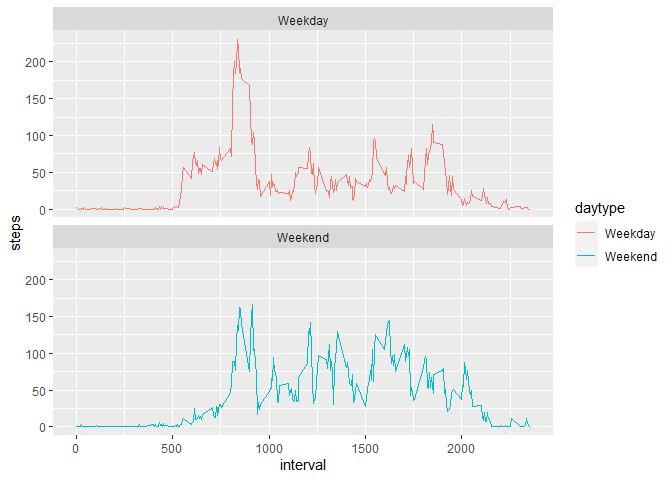

## Loading and preprocessing the data
```{r results='asis', echo=TRUE}```

**Downloading the Data File**


```r
library(data.table)
```

```
## Warning: package 'data.table' was built under R version 3.6.3
```

```r
if (!file.exists('activity.csv')){
  fileUrl = "https://d396qusza40orc.cloudfront.net/repdata%2Fdata%2Factivity.zip"
download.file(fileUrl, destfile = "Activity monitoring data.zip")
unzip(zipfile="Activity monitoring data.zip")
}
```


```r
library(dplyr)
```

```
## Warning: package 'dplyr' was built under R version 3.6.3
```

```
## 
## Attaching package: 'dplyr'
```

```
## The following objects are masked from 'package:data.table':
## 
##     between, first, last
```

```
## The following objects are masked from 'package:stats':
## 
##     filter, lag
```

```
## The following objects are masked from 'package:base':
## 
##     intersect, setdiff, setequal, union
```

```r
library(ggplot2)
```

```
## Warning: package 'ggplot2' was built under R version 3.6.3
```

```r
Data <- read.csv('activity.csv')
Data$date <- as.Date(as.character(Data$date), format = "%y-%m-%d")
head(Data)
```

```
##   steps date interval
## 1    NA <NA>        0
## 2    NA <NA>        5
## 3    NA <NA>       10
## 4    NA <NA>       15
## 5    NA <NA>       20
## 6    NA <NA>       25
```

## What is mean total number of steps taken per day?

**Changing the formatting of the data**


```r
data <- read.csv(file = "activity.csv", header = TRUE, sep = ",")
data$date <- as.Date(data$date, format = "%Y-%m-%d")
```

**Finding Total steps taken per day**


```r
stepsPerDay <- data %>% 
  filter(!is.na(steps)) %>%
  group_by(date) %>%
  summarize(steps = sum(steps)) %>%
  print
```

```
## `summarise()` ungrouping output (override with `.groups` argument)
```

```
## # A tibble: 53 x 2
##    date       steps
##    <date>     <int>
##  1 2012-10-02   126
##  2 2012-10-03 11352
##  3 2012-10-04 12116
##  4 2012-10-05 13294
##  5 2012-10-06 15420
##  6 2012-10-07 11015
##  7 2012-10-09 12811
##  8 2012-10-10  9900
##  9 2012-10-11 10304
## 10 2012-10-12 17382
## # ... with 43 more rows
```

**Histogram**


```r
ggplot(stepsPerDay, aes(steps)) +
  geom_histogram(fill = "navy") +
  labs(title = "Steps Per Day", x = "Steps per day", y = "Frequency")+
  theme (plot.title = element_text(hjust = 0.5))
```

```
## `stat_bin()` using `bins = 30`. Pick better value with `binwidth`.
```

<!-- -->

```r
dev.copy(png,'plot1.png', width=480,height=480)
```

```
## png 
##   3
```

```r
dev.off()
```

```
## png 
##   2
```

**Finding out mean and Median**


```r
Mean <- mean(stepsPerDay$steps)
Mean
```

```
## [1] 10766.19
```

```r
Median <- median(stepsPerDay$steps)
Median
```

```
## [1] 10765
```


## What is the average daily activity pattern?

Make a time series plot (type = "l") of the 5-minute interval (x-axis) and the average number of steps taken, averaged across all days (y-axis)


```r
meaninterval <- data %>%
  filter(!is.na(steps)) %>%
  group_by(interval) %>%
  summarise (Average = mean(steps)) %>%
  print
```

```
## `summarise()` ungrouping output (override with `.groups` argument)
```

```
## # A tibble: 288 x 2
##    interval Average
##       <int>   <dbl>
##  1        0  1.72  
##  2        5  0.340 
##  3       10  0.132 
##  4       15  0.151 
##  5       20  0.0755
##  6       25  2.09  
##  7       30  0.528 
##  8       35  0.868 
##  9       40  0     
## 10       45  1.47  
## # ... with 278 more rows
```

**Time Series Plot**

```r
ggplot(meaninterval, aes(interval,Average)) +
  geom_line (lwd= 1, col="navy") +
  labs (title = "Average Steps taken per interval", x= "5 minute intervals", y="Average number of steps") +
  theme (plot.title = element_text (hjust = 0.5))
```

<!-- -->

```r
dev.copy(png,'plot2.png', width=480,height=480)
```

```
## png 
##   3
```

```r
dev.off()
```

```
## png 
##   2
```

Which 5-minute interval, on average across all the days in the dataset, contains the maximum number of steps?


```r
Maxinterval <- meaninterval$interval[which.max(meaninterval$Average)]
Maxinterval 
```

```
## [1] 835
```

## Imputing missing values

**1. Calculate and report the total number of missing values in the dataset (i.e. the total number of rows with NAs)**


```r
sum(is.na(data$steps))
```

```
## [1] 2304
```

**2. Devise a strategy for filling in all of the missing values in the dataset. The strategy does not need to be sophisticated. For example, you could use the mean/median for that day, or the mean for that 5-minute interval, etc.**

Taking mean of the intevals and assigning it to NAs


```r
datafull <- data
na <- which(is.na(data$steps))
meansteps <- tapply(data$steps,data$interval,mean,na.rm=T)

datafull$steps[na] <- meansteps [as.character(datafull$interval[na])]
sum(is.na(datafull$steps))
```

```
## [1] 0
```

**3. Create a new dataset that is equal to the original dataset but with the missing data filled in.**


```r
Allsteps <- datafull %>%
  group_by(date) %>%
  summarise(steps=sum(steps)) %>%
  print()
```

```
## `summarise()` ungrouping output (override with `.groups` argument)
```

```
## # A tibble: 61 x 2
##    date        steps
##    <date>      <dbl>
##  1 2012-10-01 10766.
##  2 2012-10-02   126 
##  3 2012-10-03 11352 
##  4 2012-10-04 12116 
##  5 2012-10-05 13294 
##  6 2012-10-06 15420 
##  7 2012-10-07 11015 
##  8 2012-10-08 10766.
##  9 2012-10-09 12811 
## 10 2012-10-10  9900 
## # ... with 51 more rows
```

**4. Make a histogram of the total number of steps taken each day and Calculate and report the mean and median total number of steps taken per day. Do these values differ from the estimates from the first part of the assignment? What is the impact of imputing missing data on the estimates of the total daily number of steps?**


```r
ggplot(Allsteps, aes(steps)) +
  geom_histogram(fill="navy") +
  labs(title="Steps per day with filled missing values", x="Steps per day", y="Frequency") +
  theme(plot.title = element_text(hjust=0.5))
```

```
## `stat_bin()` using `bins = 30`. Pick better value with `binwidth`.
```

<!-- -->

```r
dev.copy(png,'plot3.png', width=480,height=480)
```

```
## png 
##   3
```

```r
dev.off()
```

```
## png 
##   2
```


```r
newMean <- mean(Allsteps$steps)
newMean
```

```
## [1] 10766.19
```

```r
newMedian <- median(Allsteps$steps)
newMedian
```

```
## [1] 10766.19
```


## Are there differences in activity patterns between weekdays and weekends?

**1. Create a new factor variable in the dataset with two levels – “weekday” and “weekend” indicating whether a given date is a weekday or weekend day.**


```r
datafull$daytype <- ifelse(weekdays(datafull$date) %in% c("Saturday","Sunday"), "Weekend", "Weekday")
```

**2. Make a panel plot containing a time series plot (i.e. \color{red}{\verb|type = "l"|}type = "l") of the 5-minute interval (x-axis) and the average number of steps taken, averaged across all weekday days or weekend days (y-axis). See the README file in the GitHub repository to see an example of what this plot should look like using simulated data.**


```r
datafullmean <- datafull %>%
  group_by(interval,daytype) %>%
  summarise (steps=mean(steps)) %>%
  print()
```

```
## `summarise()` regrouping output by 'interval' (override with `.groups` argument)
```

```
## # A tibble: 576 x 3
## # Groups:   interval [288]
##    interval daytype   steps
##       <int> <chr>     <dbl>
##  1        0 Weekday 2.25   
##  2        0 Weekend 0.215  
##  3        5 Weekday 0.445  
##  4        5 Weekend 0.0425 
##  5       10 Weekday 0.173  
##  6       10 Weekend 0.0165 
##  7       15 Weekday 0.198  
##  8       15 Weekend 0.0189 
##  9       20 Weekday 0.0990 
## 10       20 Weekend 0.00943
## # ... with 566 more rows
```

```r
ggplot(datafullmean, aes(interval, steps, color=daytype)) +
  geom_line() +
  facet_wrap(~daytype, ncol=1) +
  theme(plot.title = element_text(hjust=0.5))
```

<!-- -->

```r
dev.copy(png,'plot4.png', width=480,height=480)
```

```
## png 
##   3
```

```r
dev.off()
```

```
## png 
##   2
```
